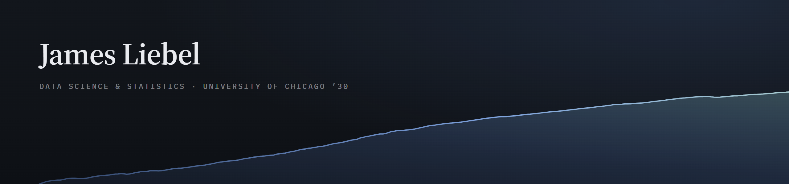

I build data tools and ship them. This past summer at Siemens Digital Industries I built the platform that runs their student internship program: registration, mentor-reviewed goal setting, evaluations, e-signature sign-off, and learning-hours tracking. It went live for 200+ students, mentors, and managers across four regional programs.

Mostly Python, SQL, and scikit-learn. Microsoft certified in Power BI.

  
  
  
  
  
  
  
  
  
  

### Selected work

| Project | What it is |
| --- | --- |
| **[Portfolio site](https://james-liebel.github.io/portfolio-site/)** · [source](https://github.com/James-Liebel/portfolio-site) | Static site, no framework or build step. Six interactive D3 charts and an embedded Power BI report. |
| **[SpaceX landing prediction](https://github.com/James-Liebel/Personal_Projects/tree/main/projects/SpaceX)** | Eight notebooks end to end: API collection, web scraping, wrangling, SQL EDA, Folium maps, a Dash app, and classifiers reaching 90% test accuracy via GridSearchCV. |
| **[Machine learning notebooks](https://github.com/James-Liebel/Personal_Projects/tree/main/projects/machine_learning)** | Credit card fraud detection with XGBoost and SMOTE on 284,807 transactions at a 0.17% positive rate: 80% recall at 87% precision, ROC-AUC 0.939. Plus cancer classification, CNN digit recognition, and k-means clustering. |
| **[CustomStrat](https://customstrat.com)** · [source](https://github.com/James-Liebel/customstrat-site) | Client site I designed and shipped. 29 pages, statically exported, with a typed content layer that derives every article and nav entry from one source. |

### Elsewhere

  
  
  

